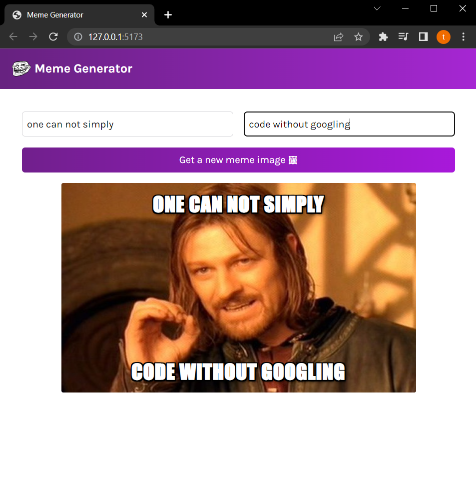

# Meme-generator

## In this project, I used useEffect hook to fetch memes data from memes API. at the same time, handling side effects. also, changing the state of an object with the help of the spread operator. and dealing with forms in react.

Quick start:

```
$ npm run dev
````




## Authors

- [@Tarek Habash](https://github.com/tarek797)